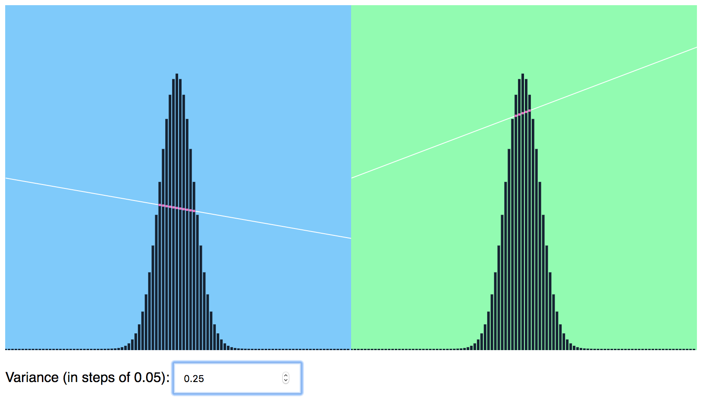

# pts-react-example

[Pts](https://github.com/williamngan/pts) is a typescript/javascript library for visualization and creative-coding. Get started at [ptsjs.org](https://ptsjs.org).

This project provides examples of using [Pts](https://github.com/williamngan/pts) in [React](https://github.com/facebook/react) components. This might be one of the simplest ways to make canvas animation in React.

- Take a look at [the demo](https://williamngan.github.io/pts-react-example/build/).
- Download or clone this repo and run `npm install`. Once installed, run `npm start`.
- Quick start by extending the base [`PtsComponent`](https://github.com/williamngan/pts-react-example/blob/master/src/PtsComponent.jsx) to create your custom component. See components in [`PtsExamples`](https://github.com/williamngan/pts-react-example/blob/master/src/PtsExamples.jsx) that use this approach.
- You can also use the [online demo editor](http://ptsjs.org/demo/edit/?name=polygon.convexHull) for quick experimentations.
- Not yet recommended for use in production builds. See notes below.

   

---

### Technical notes
Pts is an javascript es6 library that targets modern browsers. If you need es5 to support older browsers, you may need to configure your build tools accordingly. At this stage, the library may not be stable enough for production use.

Some pointers:

- UglifyJS doesn't seem to support extending built-in types unless the code is transformed to es5 first. You may consider other minify tool such as [uglify-es](https://github.com/mishoo/UglifyJS2/tree/harmony) or [babel-minify](https://github.com/babel/minify) (see a babel-minify example [in this repo](https://github.com/williamngan/pts-starter-kit)). The next major release of React should support [es6 builds](https://github.com/facebook/create-react-app/pull/3776).

- You may (or may not) need the [builtin-extend](https://github.com/loganfsmyth/babel-plugin-transform-builtin-extend) or [transform-classes](https://babeljs.io/docs/en/next/babel-plugin-transform-classes.html) plugins because Pts extends built-in types like Array and Float32Array. These may no longer be needed as build tools improve.

Javascript ecosystem is quite a moving target! If you're an expert in React and javascript build tools, please share your thoughts on best practices by posting in [Issues](https://github.com/williamngan/pts-react-example/issues). :pray: